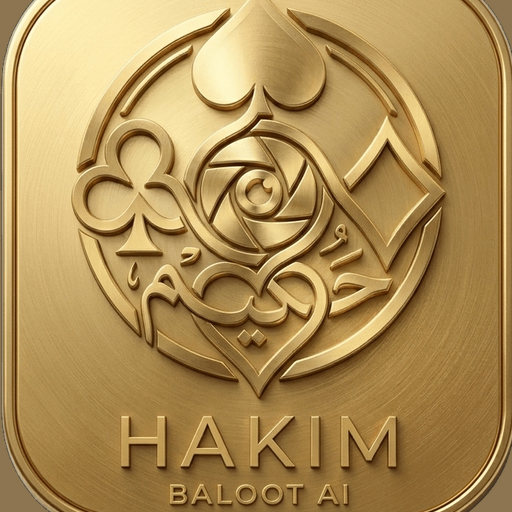
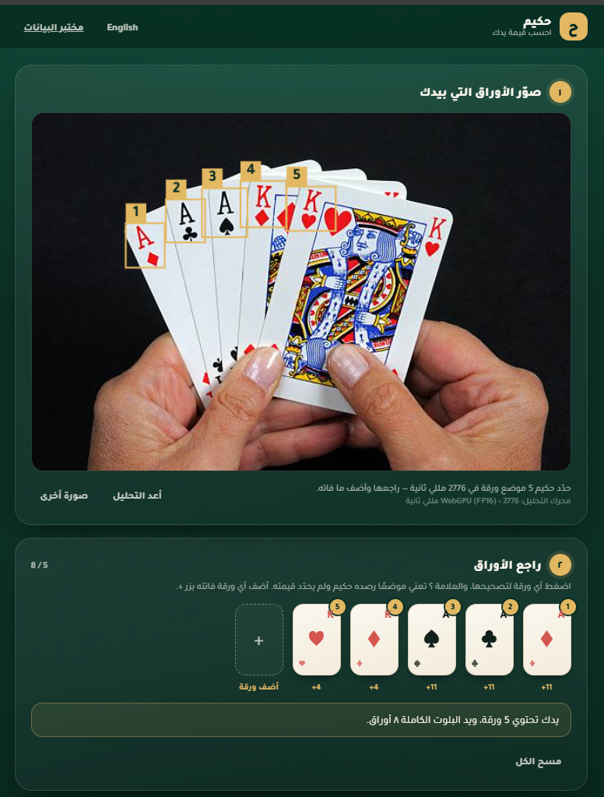
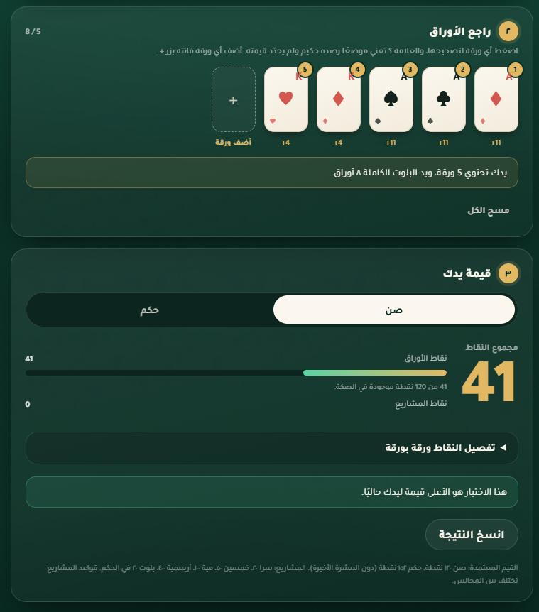
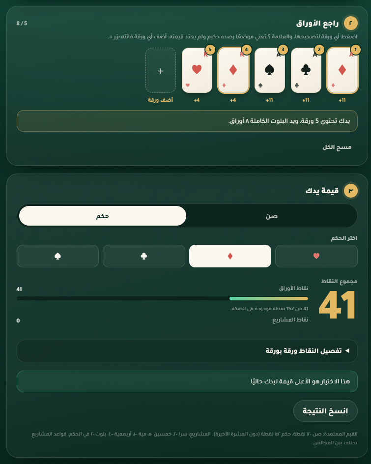
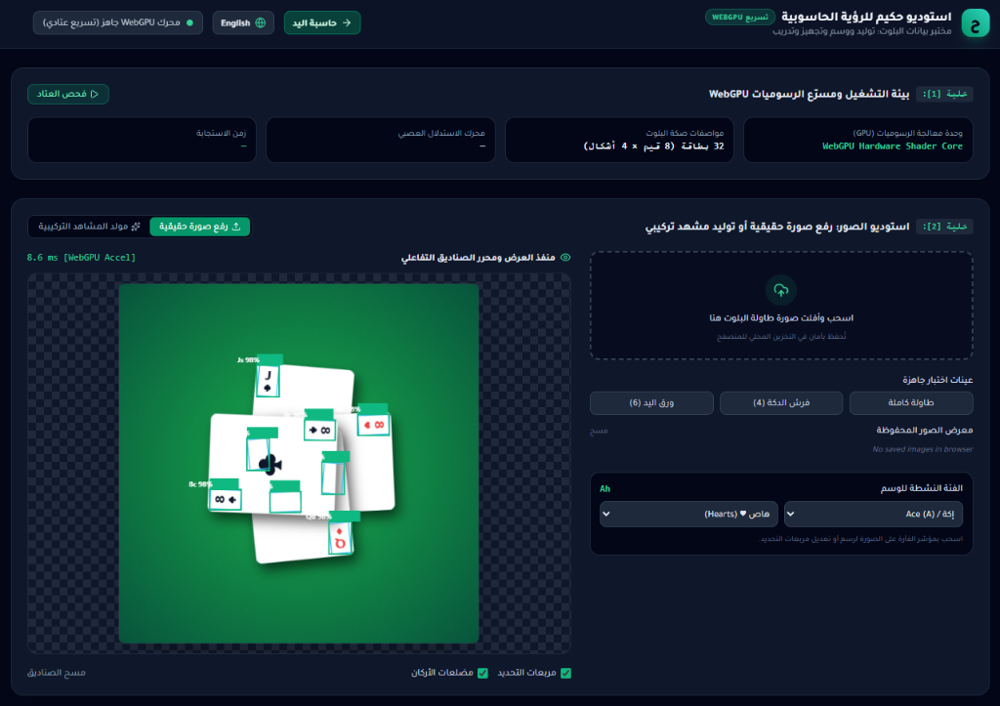
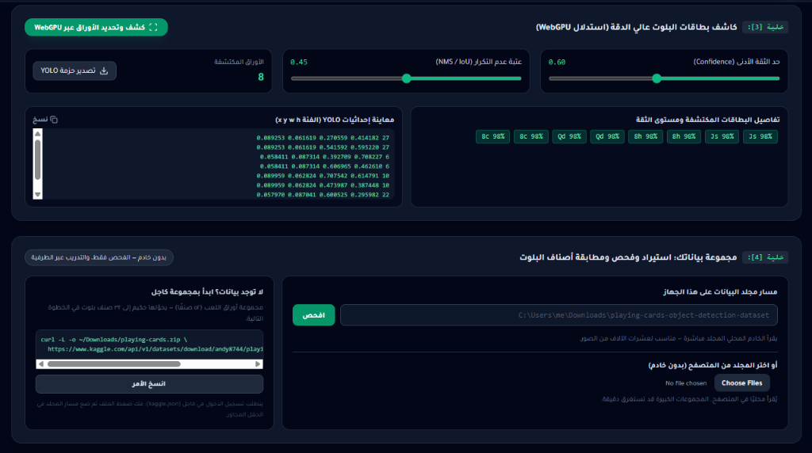
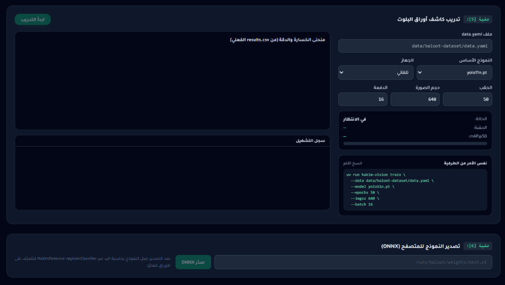

<div align="center">



# 🃏 hakim-vision | استوديو حكيم للرؤية الحاسوبية
### منظومة الذكاء الاصطناعي والرؤية الحاسوبية لحساب وتقييم أوراق البلوت السعودي
#### SOTA Saudi Baloot Card Detection, Scoring Engine & In-Browser WebGPU Studio

[](https://github.com/osos3lom/AIBaloot/actions/workflows/ci.yml)
[](https://osos3lom.github.io/AIBaloot/)
[](LICENSE)
[](https://www.python.org/)
[](https://osos3lom.github.io/AIBaloot/)
[](web/models/model-card.md)
[](web/models/model-card.md)

<br>

<p align="center">
  <a href="#english-documentation"><strong>🌐 English Documentation (الانتقال للنسخة الإنجليزية) ↓</strong></a>
</p>

<p align="center">
  <a href="https://osos3lom.github.io/AIBaloot/"><strong>🚀 تجربة التطبيق المباشر (Live App)</strong></a> •
  <a href="https://osos3lom.github.io/AIBaloot/studio.html"><strong>🔬 استوديو ومختبر البيانات (Studio)</strong></a> •
  <a href="#-معرض-الواجهات-والشاشات-التفاعلية"><strong>📸 معرض الشاشات</strong></a> •
  <a href="#-دليل-البدء-السريع"><strong>⚡ البدء السريع</strong></a> •
  <a href="#-التوثيق-والمراجع"><strong>📖 التوثيق</strong></a>
</p>

---

</div>

## 🇸🇦 نبذة عن المشروع

**hakim-vision** هو الركيزة الأساسية للرؤية الحاسوبية والذكاء الاصطناعي لمنصة **حكيم (Hakim)** المفتوحة المصدر للعبة البلوت السعودي. 

يتيح لك النظام تصوير أوراق اللعب بكاميرا الجوال أو المتصفح، والتعرف عليها فوريًا عبر نموذج **YOLO11** فائق الدقة، مع حساب قيمة يدك بدقة متناهية في نظامي **الصن** و **الحكم** ومشاريع اللعب (سرا، خمسين، مية، أربعمية، بلوت)، وكل ذلك **داخل المتصفح وبشكل محلي 100%** دون إرسال صورك لأي خادم سحابي بفضل تقنيات تسريع الرسوميات **WebGPU** و **WebAssembly**.

> 🌐 **رابط التطبيق المباشر (Live Web App)**: يمكنك تجربة الكاشف اللحظي وحاسبة نقاط البلوت مباشرة عبر الرابط:  
> 👉 [https://osos3lom.github.io/AIBaloot](https://osos3lom.github.io/AIBaloot)

---

## 📸 معرض الواجهات والشاشات التفاعلية

### 1. كاشف الأوراق اللحظي ومراجعة يد اللاعب
<div align="center">
  
  <p><em>⚡ رصد وتحديد فوري لأوراق البلوت في مروحة اليد عبر WebGPU مع إمكانية التحقق والتعديل اللحظي التفاعلي</em></p>
</div>

---

### 2. حاسبة قيمة اليد ومحرك حساب نقاط الصن والحكم
<div align="center">
  <table>
    <tr>
      <td width="50%" align="center">
        
        <br>
        <strong>☀️ حساب القيمة في نظام الصن (Sun Mode)</strong>
        <br>
        <sub>حساب دقيق لنقاط الأوراق من 120 نقطة وتفصيل قيمة كل ورقة والمشاريع المتوفرة</sub>
      </td>
      <td width="50%" align="center">
        
        <br>
        <strong>👑 حساب القيمة في نظام الحكم (Hokom Mode)</strong>
        <br>
        <sub>تحديد لون الحكم (♦, ♥, ♣, ♠) مع إعادة تقييم الولد والتسعة وحساب نقاط الصكة (152 نقطة)</sub>
      </td>
    </tr>
  </table>
</div>

---

### 3. استوديو البيانات: تسريع WebGPU وتوليد المشاهد وفحص البيانات
<div align="center">
  <table>
    <tr>
      <td width="50%" align="center">
        
        <br>
        <strong>🔬 خلية [1] و [2]: بيئة WebGPU ومولد المشاهد التركيبية</strong>
        <br>
        <sub>فحص عتاد كرت الشاشة، توليد مشاهد الطاولة وتركيب الأوراق مع المحاكاة الفيزيائية</sub>
      </td>
      <td width="50%" align="center">
        
        <br>
        <strong>📊 خلية [3] و [4]: كاشف YOLO واستيراد مجموعات البيانات</strong>
        <br>
        <sub>معاينة إحداثيات YOLO، استيراد مجموعات Kaggle ومطابقة الأصناف لـ 32 فئة بلوت</sub>
      </td>
    </tr>
  </table>
</div>

---

### 4. استوديو التدريب: تدريب كاشف البلوت وتصدير أوزان ONNX
<div align="center">
  
  <p><em>🚀 خلية [5] و [6]: ضبط المعاملات الفائقة (Hyperparameters)، مراقبة منحنيات الخسارة والدقة mAP@50، وتصدير الأوزان مباشرة للمتصفح</em></p>
</div>

---

## ✨ أبرز المزايا والقدرات

```
                  ┌─────────────────────────────────────────────────────────┐
                  │                 كاميرا الجوال أو المتصفح                 │
                  └────────────────────────────┬────────────────────────────┘
                                               │ (معالجة محلية 100% بدون خادم)
                                               ▼
                  ┌─────────────────────────────────────────────────────────┐
                  │             معالج التنسيقات عبر WebGPU                  │
                  │   • ضبط الأبعاد إلى 416x416 عبر الشيدر الرسومي           │
                  │   • رفع الإطارات مباشرة إلى ذاكرة كرت الشاشة FP16        │
                  └────────────────────────────┬────────────────────────────┘
                                               │
                                               ▼
                  ┌─────────────────────────────────────────────────────────┐
                  │              نموذج YOLO11 في المتصفح                    │
                  │   • 33 صنفاً (32 ورقة بلوت + صنف الأوراق الأخرى)         │
                  │   • استدلال WebGPU فائق السرعة (~15-30 مللي ثانية)       │
                  └────────────────────────────┬────────────────────────────┘
                                               │
                                               ▼
                  ┌─────────────────────────────────────────────────────────┐
                  │             محرك حساب وتقييم البلوت السعودي             │
                  │   • الحساب الرياضي الدقيق لنقاط الصن والحكم             │
                  │   • احتساب المشاريع (سرا، خمسين، مية، 400، بلوت)        │
                  └─────────────────────────────────────────────────────────┘
```

- **⚡ خصوصية كاملة وذكاء اصطناعي محلي**: يتم تشغيل شبكة الاستدلال العصبي بالكامل على متصفحك عبر `onnxruntime-web` ومسرع **WebGPU**. لا يتم رفع أي صورة لخادم خارجي إطلاقاً.
- **🃏 33 صنفاً مخصصاً للبلوت السعودي**:
  - **8 قيم (Ranks)**: إكة (Ace)، شايب (King)، بنت (Queen)، ولد (Jack)، 10، 9، 8، 7.
  - **4 أشكال (Suits)**: هاص ♥ (Hearts)، ديمن ♦ (Diamonds)، كلوف ♣ (Clubs)، سبيت ♠ (Spades).
  - **صنف للأوراق الأخرى (Other)**: للقيم 2–6 لتفادي التعرف الخاطئ عند استخدام صكات البوكر 52 ورقة.
- **📐 محرك الحساب الرياضي المعتمد للبلوت**: كود JavaScript فائق السرعة لحساب نقاط الصن (120 نقطة) والحكم (152 نقطة) ومشاريع اللعب بدقة متناهية.
- **🧪 منظومة متكاملة لإدارة وتجهيز البيانات**: أدوات سطر أوامر لتحميل وفحص وحذف الصور المكررة عبر البصمة الإدراكية (Perceptual dHash) وإعادة هيكلة البيانات لصيغة البلوت.
- **🚀 تكميم الأوزان (Quantization) وفحص التكافؤ**: خط تصدير مؤتمت للأوزان بصيغة FP16 لـ WebGPU وتكميم ساكن INT8 للـ WASM مع اختبار التكافؤ عبر مقياس mAP.

---

## ⚡ دليل البدء السريع

### 1. تشغيل الاستوديو المحلي في المتصفح

```bash
# استنساخ المستودع
git clone https://github.com/osos3lom/AIBaloot.git
cd AIBaloot

# تثبيت مدير الحزم uv ومزامنة الاعتماديات
uv sync --all-extras

# تشغيل استوديو الويب المعرب
uv run hakim-vision studio
```

افتح الرابط `http://localhost:8000` في متصفحك.

---

### 2. أوامر إدارة البيانات وتدريب النموذج

```bash
# 1. فحص مجلد مجموعة البيانات
uv run hakim-vision dataset inspect --source data/downloads/playing-cards

# 2. معاينة بصرية لصناديق التحديد Bounding Boxes
uv run hakim-vision dataset preview --source data/downloads/playing-cards --output data/preview

# 3. فحص وحذف الصور المكررة إدراكياً لمنع تسرب البيانات
uv run hakim-vision dataset dedupe --source data/downloads/playing-cards --threshold 4 --drop-leaks

# 4. إعادة تعيين أصناف الصكة الـ 52 إلى أصناف البلوت الـ 33
uv run hakim-vision dataset remap --source data/downloads/playing-cards --output data/baloot-dataset --unmapped other

# 5. تدريب كاشف YOLO11 للبلوت
uv run hakim-vision train --data data/baloot-dataset/data.yaml --model yolo11n.pt --epochs 120 --imgsz 416

# 6. تصدير نموذج ONNX FP16 مخصص لـ WebGPU
uv run hakim-vision export --weights runs/hakim/baloot/weights/best.pt --output web/models/baloot-v1.fp16.onnx --half

# 7. التكميم الساكن INT8 لتسريع المعالجة على المعالجات المركزية WASM
uv run hakim-vision quantize --model runs/hakim/baloot/weights/best_fp32.onnx --output web/models/baloot-v1.int8.onnx --calib-dir data/baloot-dataset/images/train

# 8. فحص تكافؤ الدقة على عينة الاختبار المنفصلة
uv run hakim-vision evaluate-parity --model web/models/baloot-v1.fp16.onnx --images data/baloot-dataset/images/test --labels data/baloot-dataset/labels/test
```

---

### 3. تشغيل الاختبارات وفحص جودة الكود

```bash
# تشغيل كامل حزمة اختبارات بايثون مع تقرير التغطية
uv run pytest -q

# فحص الأنواع الصارم (Strict Type Checking)
uv run mypy

# فحص التنسيق والجودة البرمجية
uv run ruff check .
uv run ruff format --check .

# تشغيل اختبارات محرك حساب البلوت في جافاسكريبت
node --test web/scoring.test.js
```

---

## 📁 هيكل وشجرة المستودع

```
AIBaloot/
├── docs/
│   ├── assets/               # شعارات وصور الشاشات عالية الدقة
│   │   ├── hakim_logo.png
│   │   ├── hand_detection_webgpu.png
│   │   ├── sun_scoring_calculator.png
│   │   ├── hokom_scoring_calculator.png
│   │   ├── studio_cell1_cell2.png
│   │   ├── studio_cell3_cell4.png
│   │   └── studio_cell5_cell6.png
│   ├── detector_pipeline.md  # معمارية YOLO11 ومواصفات WebGPU
│   └── migration.md          # توثيق تحديث الكود من الدفاتر القديمة
├── src/hakim_vision/         # حزمة بايثون المكتوبة ومختبرة بالكامل
│   ├── cli.py                # واجهة سطر الأوامر الموحدة (`hakim-vision`)
│   ├── config.py             # إعدادات Pydantic
│   ├── geometry.py           # تحويل الإحداثيات وحساب تقاطع الصناديق IoU
│   ├── datasets/             # اكتشاف وفحص وإزالة تكرار البيانات
│   ├── models/               # التدريب، تصدير ONNX، تكميم INT8، وفحص التكافؤ
│   ├── server.py             # خادم API المحلي للاستوديو
│   └── synthetic/            # مولد المشاهد التركيبية ومحزم الشظايا
├── web/                      # Zero-install client-side Web application
│   ├── index.html            # Player app: Camera photo -> WebGPU YOLO -> Baloot value
│   ├── studio.html           # Interactive Dataset Studio & Model Workbench
│   ├── app.js / lab.js       # UI controllers with full Arabic/English i18n
│   ├── model-runner.js       # In-browser WebGPU & WASM ONNX runner
│   ├── scoring.js            # Saudi Baloot scoring arithmetic engine
│   ├── scoring.test.js       # Scoring test suite (node --test)
│   ├── models/               # Model weights & Model Card
│   └── runtime/              # Self-hosted ONNX Runtime WebGPU binaries
├── tests/                    # 100 اختبار شامل بنسبة نجاح 100%
├── .github/workflows/        # خطوط أنابيب CI وبناء Pages والإصدارات
├── Dockerfile                # حاوية تشغيل الإنتاج متعددة المراحل
└── pyproject.toml            # تعريف الحزم وأدوات التطوير الحديثة
```

---

<hr id="english-documentation">

<div align="center">

## 🇬🇧 English Documentation

<p align="center">
  <a href="#-hakim-vision--استوديو-حكيم-للرؤية-الحاسوبية"><strong>⬆️ العودة للبداية (اللغة العربية) / Back to Top</strong></a>
</p>

</div>

### Overview
**hakim-vision** is the state-of-the-art computer-vision and edge AI pillar of the **Hakim** open-source Saudi Baloot platform. It enables zero-install, real-time playing card detection from camera photos directly within the browser using a customized **YOLO11** detector running on **WebGPU (FP16)** and **WASM (INT8)**, coupled with an authoritative Baloot scoring arithmetic engine for Sun (صن) and Hokum (حكم).

> 🌐 **Live Web Application**: Experience the in-browser real-time card detector and valuation engine at:  
> 👉 [https://osos3lom.github.io/AIBaloot](https://osos3lom.github.io/AIBaloot)

### Key Architectural Highlights
- **100% Client-Side Privacy**: Neural network tensor inference executes locally on device graphics shaders (`onnxruntime-web`). No video streams or photos are sent to remote servers.
- **33-Class Baloot Ontology**: Specialized for Saudi Baloot's 32-card deck (8 Ranks $\times$ 4 Suits) + 1 `other` class for 52-card poker compatibility.
- **Authoritative Scoring**: Pure JavaScript valuation engine covering trick score arithmetic (Sun 120 pts, Hokum 152 pts) and project declarations (Sira, 50, 100, 400, Baloot).
- **Data Engineering CLI**: Modular Python toolchain for dataset inspection, perceptual dHash deduplication, class remapping, YOLO11 training, FP16 ONNX export, and static INT8 calibration.

### Quick Start (English)
```bash
# 1. Sync dependencies with uv
uv sync --all-extras

# 2. Launch the WebGPU Studio locally
uv run hakim-vision studio

# 3. Run full test suite & linters
uv run pytest -q
uv run mypy
uv run ruff check .
node --test web/scoring.test.js
```

---

## 📖 التوثيق والمراجع | Documentation

- 📘 **[Architecture & Pipeline Guide](docs/detector_pipeline.md)**: Deep dive into YOLO11 training, stretch preprocessing, quantization, and WebGPU shaders.
- 🃏 **[Model Card (v1.0.0)](web/models/model-card.md)**: Accuracy metrics, mAP@50 benchmarks, and runtime latency measurements.
- 🔄 **[Migration Notes](docs/migration.md)**: Details on replacing the legacy 2018 notebook with modern modular Python & WebAssembly.

---

## 🤝 المساهمة | Contributing

نرحب بجميع المساهمات والاقتراحات البرمجية!
- يرجى مراجعة [`CONTRIBUTING.md`](CONTRIBUTING.md) لإعداد بيئة التطوير.
- للإبلاغ عن الثغرات الأمنية، يرجى مراجعة [`SECURITY.md`](SECURITY.md).

---

## 📄 الترخيص | License

هذا المشروع مرخص بموجب رخصة [MIT License](LICENSE).
<br>
صُنع بكل ❤️ لدعم مجتمع الذكاء الاصطناعي ولعبة البلوت السعودي المفتوحة المصدر.
